#**Self-Driving Car Nanodegree, Project 2 - Traffic Sign Recognition** 

##Writeup - Ricardo Picatoste

---

**Build a Traffic Sign Recognition Project**

In this project, a neural network for traffic sign recognition is created and trained. 

## Rubric Points
Here I consider the [rubric points](https://review.udacity.com/#!/rubrics/481/view) individually and describe how I addressed each point in my implementation.  

---
###Writeup / README

####1. Provide a Writeup / README that includes all the rubric points and how you addressed each one. You can submit your writeup as markdown or pdf. You can use this template as a guide for writing the report. The submission includes the project code.

This markdown file is the writeup, that the project code can be found in my [github repository](https://github.com/rpicatoste/carnd-term1-project2-traffic-sign-classifier) for it.

###Data Set Summary & Exploration

####1. Provide a basic summary of the data set and identify where in your code the summary was done. In the code, the analysis should be done using python, numpy and/or pandas methods rather than hardcoding results manually.

The code for this step is contained in the paragraph *Step 1: Dataset Summary & Exploration* of the notebook. I used the standard len() method and numpy array shape to calculate and summarize statistics of the traffic
signs data set:

- Image Shape: (32, 32, 3)
- Training Set:   34799 samples
- Validation Set:  4410 samples
- Test Set:       12630 samples

As for the labels representing each type of sign, this is the summary:

- There are : 43 label types
- Example: ('9', 'No passing')
- Example: ('20', 'Dangerous curve to the right')

####2. Include an exploratory visualization of the dataset and identify where the code is in your code file.

To check how the images look like, I created a function that plots the image and shows its number from the set and the sign type. Here are some random examples:

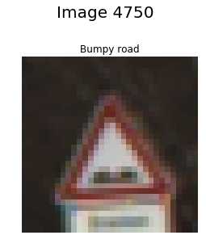 
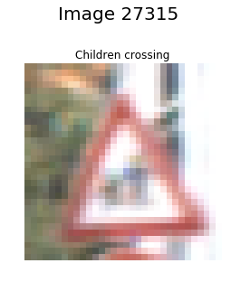 
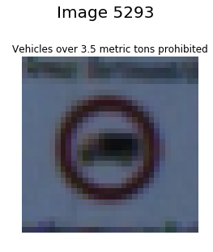

To verify that there is a proper distribution of signal types between the 3 datasets, I created a graph showing, for each signal type, how it is distributed on each dataset.

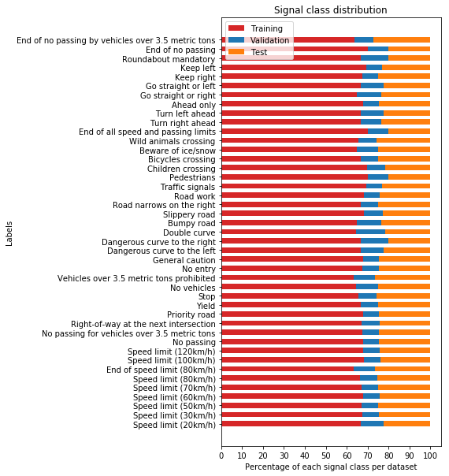

The distribution of each signal is not exactly the same, but we can see that all have a fair representation on each dataset, and there is no sign with a significantly low number of samples in any of the datasets.

###Design and Test a Model Architecture

####1. Describe how, and identify where in your code, you preprocessed the image data. What techniques were chosen and why did you choose these techniques? Consider including images showing the output of each preprocessing technique. Pre-processing refers to techniques such as converting to grayscale, normalization, etc.

For the preprocessing I chose to use the batch_norm layer for the input data in order to normalize the images as they enter the network, without needed to store the images twice, once the original image and second the normalized image. This makes the network more practical, avoiding the need to preprocess any batch of images that I would want to test or use for training.

This is the piece of code for preprocessing:

    # Normalize input
    x = tf.contrib.layers.batch_norm( x, is_training = True)

As for the color, I decided to keep the 3 layers of color, since traffic signs use color to provide some information. Prohibition or limitation use red, allow or end of limitations are blue or black-white, etc.

####2. Describe how, and identify where in your code, you set up training, validation and testing data. How much data was in each set? Explain what techniques were used to split the data into these sets.

In the jupyter notebook that I downloaded, there was 3 datasets already provided: train, validation and test. I believe that in a previous version of the notebook only 2 datasets where provided and the 3rd one had to be extracted from those. This is not the case anymore. 

However new images are used later in the project, obtained from the internet.

####3. Describe, and identify where in your code, what your final model architecture looks like including model type, layers, layer sizes, connectivity, etc.) Consider including a diagram and/or table describing the final model.

The architecture used for the classification is described in the function Lanet().

My final model consisted of the following layers:

- Layer: Description 
- Input: 32x32x3 RGB image 
	- The input is normalized with batch_norm.  							
- Convolution layer 1:
	- Convolution 5x5: 1x1 stride, valid padding, outputs 28x28x16.	
	- Max pooling 2x2 size, 2x2 stride, outputs 14x14x16		
	- Relu (after pooling to reduce the operation by 1/4)
	- Batch normalization. 
- Convolution layer 2:
	- Convolution 5x5: 1x1 stride, valid padding, outputs 10x10x32.	
	- Max pooling 2x2 size, 2x2 stride, outputs 5x5x32		
	- Relu (after pooling to reduce the operation by 1/4)
	- Batch normalization. 
- Flatten
- Fully connected layer 1: 
	- 800 inputs, 120 outputs.
	- Relu.
	- Dropout.
- Fully connected layer 2: 
	- 120 inputs, 84 outputs.	
	- Relu.
	- Dropout.
- Output layer: 
	- 84 inputs, number of labels outputs.	
	- Linear activation function.
	
This architecture has as outputs the logits that will be passed to 
the function *softmax\_cross\_entropy\_with\_logits*, which will apply softmax, obtaining the probability of each label, and then cross entropy, to obtain the cost function to minimize (actually the mean for this value obtained for each sample of the batch will be the cost to minimize).

####4. Describe how, and identify where in your code, you trained your model. The discussion can include the type of optimizer, the batch size, number of epochs and any hyperparameters such as learning rate.

The code for training the model is located in the paragraph *Train, Validate and Test the Model*. 
The optimizer used has been AdamOptimizer. 

To choose the learning rate, I started using 0.001 like in the example with Lanet. The result was good, but then I tried a smaller rate in order to get a better accuracy, assuming that I would need just more epochs. The result however was that I could not reach the same performance by a small percentage after trying several combinations, so I stepped back to a rate of 0.001.

The keep probability for the dropout is 0.5, as normally recommended, in order to avoid overfitting. 

####5. Describe the approach taken for finding a solution. Include in the discussion the results on the training, validation and test sets and where in the code these were calculated. Your approach may have been an iterative process, in which case, outline the steps you took to get to the final solution and why you chose those steps. Perhaps your solution involved an already well known implementation or architecture. In this case, discuss why you think the architecture is suitable for the current problem.

My final model results were:

* Training accuracy = 99.4% 
* Validation Accuracy = 95.2% 
* Test Accuracy = 94.2%

I have tried with longer trainings but not obtaining better results, and therefore I decided to leave the number of epochs in 10.

As described already, I started with Lanet architecture just implemented for the example in the course. 
I adapted some of the sizes of the convolution network to deal with a bigger number of possible outcomes.

I applied batch normalization to the input and also to the output of the convolution layers, as it is highly recommended in several places and the improvement is significant.

I also added dropout to avoid overfitting, since in this way each layer in the fully connected layer would have more than one path recognizing each possible input.

I changed batch size just to avoid memory errors from the limits in my gpu. 
 

###Test a Model on New Images

####1. Choose five German traffic signs found on the web and provide them in the report. For each image, discuss what quality or qualities might be difficult to classify.

I downloaded the ["German Traffic Sign Recognition Benchmark" dataset](http://benchmark.ini.rub.de/Dataset/GTSRB_Final_Training_Images.zip) and picked randomly 5 images from it:

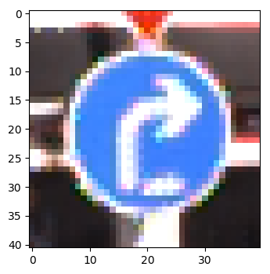 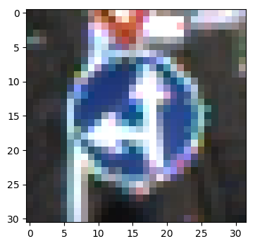 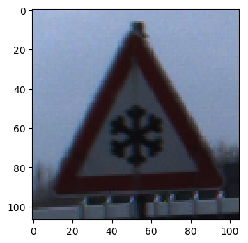 
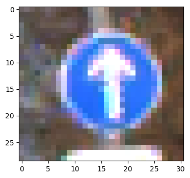 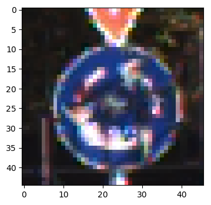

This images have different sizes and therefore they must be adapted to the input size of the network. The last looks like a very dirty sign and might be confusing for the network.

####2. Discuss the model's predictions on these new traffic signs and compare the results to predicting on the test set. Identify where in your code predictions were made. At a minimum, discuss what the predictions were, the accuracy on these new predictions, and compare the accuracy to the accuracy on the test set (OPTIONAL: Discuss the results in more detail as described in the "Stand Out Suggestions" part of the rubric).

The code for making predictions on my final model is located in the paragraph *Predict the Sign Type for Each Image and Output Top 5 Softmax Probabilities For Each Image Found on the Web*.

Here are the results of the prediction:
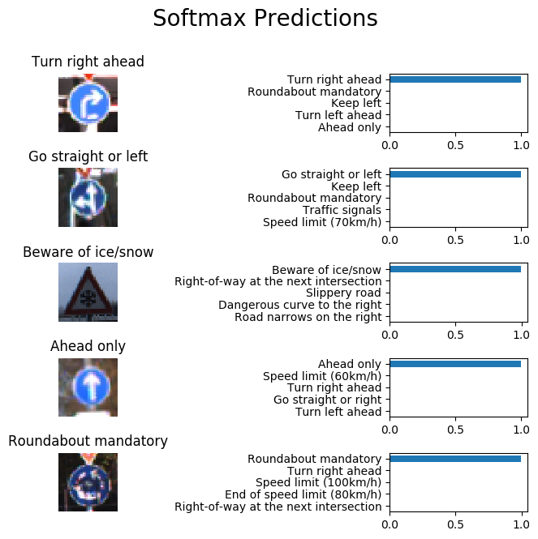

The model was able to correctly guess the 5 traffic signs, which gives an accuracy of 100%. This compares favorably to the accuracy on the test set of 94.2%, however 5 is not a statistically significant sample.

####3. Describe how certain the model is when predicting on each of the five new images by looking at the softmax probabilities for each prediction and identify where in your code softmax probabilities were outputted. Provide the top 5 softmax probabilities for each image along with the sign type of each probability. (OPTIONAL: as described in the "Stand Out Suggestions" part of the rubric, visualizations can also be provided such as bar charts)

The softmax probabilities, shown in the previous point, are very clear for these 5 images. However, in the paragraph *Show result on some images from the test batch*, each time is run it will pick some samples from the test set randomly and show the prediction and the softmax probabilities.

In the image below we can see an example where the 2nd image was difficult to predict. The probabilities show that the correct prediction won, but closely followed by others, like _keep left_. This might be because the image is not very sharp, and the contrast is very low, making it hard to distinguish clearly what there is in it.

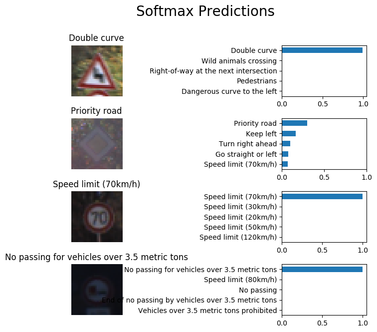
